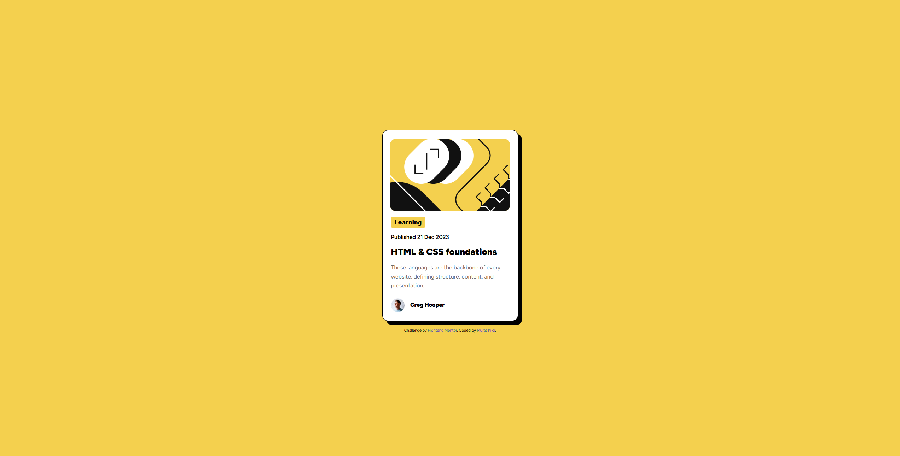
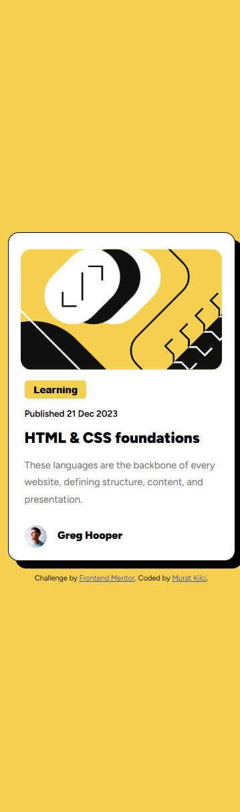

# Blog Preview Card – Frontend Mentor Challenge

This is a solution to the [Frontend Mentor](https://www.frontendmentor.io?ref=challenge) **Blog preview card** challenge. The goal of this challenge was to build a simple, visually appealing blog preview card using only HTML and CSS.

## 🔗 Live Demo

👉 [Live Site URL](https://muratkilci067.github.io/Blog-preview-card/)

---

## 🛠️ Built With

- Semantic HTML5 markup
- CSS3 (Flexbox)
- Google Fonts – [Figtree](https://fonts.google.com/specimen/Figtree)
- Mobile-first responsive design

---

## 📚 What I Learned

While building this project, I practiced:

- Using `flexbox` for layout alignment
- Applying consistent spacing and margins
- Styling interactive elements like buttons and hover effects
- Implementing a clean card UI with borders and shadows
- Using Google Fonts and Favicon

---

## 📷 Screenshots

| Desktop View | Mobile View |
|--------------|-------------|
|  |  |

---

## ✅ Features

- Fully responsive design
- Hover effect on the title
- Avatar and publishing info
- Clean and accessible UI

---

## 👨‍💻 Author

- Frontend Mentor: [@muratkilci067](https://www.frontendmentor.io/profile/muratkilci067)
- GitHub: [@muratkilci067](https://github.com/muratkilci067)
- Live demo hosted on: [your domain or GitHub Pages]

---

## 📝 Acknowledgments

This challenge is part of [Frontend Mentor](https://www.frontendmentor.io/) – a platform for improving frontend skills through real-world projects.  
Design inspiration and assets are provided by Frontend Mentor.

---

## 📌 How to Use

To run this project locally:

1. Clone the repository  
   `git clone https://github.com/muratkilci067/Blog-preview-card.git`
2. Open `index.html` in your browser
3. Optionally, deploy it using GitHub Pages or Netlify

---

## License

This project is open source and free to use.

